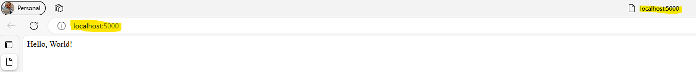

# **Challenge DevSecOps/SRE**

## **Contents**

- 📥[**Post Repo in API**](#evidence-of-the-request)
- 📝[**Introduction**](#introduction)
- 🌐[**Ingest, Store, and Expose Data Overview**](#general-objectives)
- 🚀[**Deploy the HTTP API**](#guide-to-configure-and-deploy-the-http-api)
- 🧪[**Integration Tests**](#integration-tests)
- 🖥️[**Architecture**](#architecture)
- 🚨[**How to Contribute**](#how-to-contribute)
- 🧩[**Assumptions**](#assumptions)
- 🔧[**Future Improvements**](#future-improvements)
- 🎉[**Acknowledgments, Comments, and Credits**](#acknowledgments,-comments,-and-credits)
- 📜[**License**](#license)

## 📤 **Evidence of the Request**

- To demonstrate that the POST request to the endpoint was successfully made, a Python script **`api.py`** was executed to send the specified data. Below is the output from the request:

![alt text][json]

- This snapshot demonstrates how to send a POST request to the endpoint and verify the response. The response confirms that the request was received and processed successfully.

## 📝 **Introduction**

This project focuses on developing a system for ingesting, storing, and exposing data, specifically designed for advanced analytics. The proposed solution addresses common challenges in managing large volumes of data and provides a scalable and efficient infrastructure.

### **Context**

In a data environment that is constantly growing, organizations face the need to efficiently manage large volumes of information for advanced analysis. This challenge arises from the demand for solutions that not only handle real-time data ingestion but also optimize storage and facilitate access to these data for subsequent analysis.

**Specific problems addressed:**

- **Real-Time Ingestion:** The ability to handle and process data as it arrives is crucial for modern applications that require fresh and updated data.

- **Storage Optimization:** With the continuous growth of data, there is a need for a solution that not only stores large volumes of data but also supports fast and efficient queries.

- **Data Access and Exposure:** It is essential that stored data is easily accessible and available for analysis and consumption by third parties in an efficient manner.

## 🌐 **General Objectives**

**The goals of this project are:**

1. 📥**Data Ingestion:** Develop a robust system that uses a Pub/Sub schema to efficiently manage and process incoming data messages, ensuring scalable and reliable ingestion.

2. 🗄️**Data Storage:** Implement a database optimized for analytical queries that allows for efficient storage of large volumes of data and supports complex analysis.

3. 🌐**Data Exposure:** Provide an HTTP endpoint that serves the stored data on demand, facilitating access by third parties and ensuring smooth integration with other systems.

## 🚀 **Guide to Configure and Deploy the HTTP API**

### **Prerequisites**

Before you begin, make sure you have the following installed:

- [**Docker**](https://www.docker.com/get-started)
- [**Docker Compose**](https://docs.docker.com/compose/install/)
- [**Python**](https://www.python.org/downloads/) (*for running locally without Docker*)
- [**pip**](https://pip.pypa.io/en/stable/)

### **Clone the Repository**

First, clone the repository to your local machine:

```bash
git clone https://github.com/OMaciasd/tu_latam-challenge

cd tu_latam-challenge

```

### **Environment Setup**

1. **Set Up Environment Variables**

   - Create a `**.env**` file in the project root using the `**.env-example**` file as a reference:

     ```bash
     cp .env-example .env
     ```

   - Fill in the `**.env file**` with your specific credentials and configurations.

2. **Install Dependencies**:

- If you're using Docker, this step is handled within the container. If you prefer to run the project locally:

  ```bash
  pip install -r requirements.txt

  ```

## **Running the Project**

**Using Docker**:

*This will build and start all the services defined in the docker-compose.yml file.*

  ```bash
  docker-compose up --build
  ```

**Without Docker**:

1. Run the Server.

    ```bash
    python app.py

    ```

2. Access the API.

The API will be [**available**](http://localhost:5000).

  

### **Verify the Deployment**

To ensure everything is working correctly, make a GET request to the main endpoint:

  ```bash
  curl http://localhost:5000
  ```

You should receive a response indicating that the API is up and running.

### **Production Deployment**

- For deployment in a production environment, refer to the deployment guide specific to your cloud provider or server, such as AWS, Azure, GCP, etc.

- Ensure to follow best practices for security and scalability.

## 🧩 **Project Structure**

During the implementation of the solution, the following assumptions were made:

- **Data Format**: It is assumed that the input data follows the format specified in the challenge statement. Any variations in format may require additional adjustments.

- **Execution Environment**: The development was done under the assumption that the execution environment has Python **[3.12.4]** and the necessary libraries installed. Specific details about the environment are outlined below.

- **Dependencies**: The project depends on certain libraries specified in the **`requirements.txt`** file. It is assumed that these libraries are available in the specified versions.

## 🚀 CI/CD Flow

The CI/CD pipeline for this project has been implemented using GitHub Actions to automate the continuous integration and deployment process of the API to the cloud. Below is a basic description of the flow:

1. **Continuous Integration (CI):**

   - Every time a commit is made to the `develop` or `master` branches, the CI pipeline is triggered.

   - The pipeline performs the following actions:

     - **Code Linting:** A static code analysis is performed using tools like `flake8` to ensure the code adheres to Python style conventions.

     - **Code Formatting:** The `black` formatter is applied to maintain consistency in code style.

     - **Unit Testing:** Unit tests are run using `pytest` to verify that the changes do not break existing functionality.

     - **Coverage Report Generation:** Code coverage reports are generated using `pytest-cov` and uploaded to services like Codecov or Coveralls.

2. **Continuous Deployment (CD):**

   - Once the CI tests pass successfully, the deployment process begins:

     - **Deployment to Staging Environment:** The application is first deployed to a staging environment using Docker Compose or Kubernetes.

     - **Code Review:** A manual or automated review can be configured to approve changes before deploying to production.

     - **Deployment to Production:** After approval, the new version is deployed to production using Kubernetes or another deployment service.

3. **Notifications:**

   - Notifications email are configured to inform the team about the deployment status.

## 🧪 Integration Tests

### Description of Integration Tests
Integration tests have been implemented to ensure that the different components of the system function correctly when combined. These tests verify the interaction between the data ingestion, storage, and exposure services, ensuring the system operates as expected under normal and load conditions.

The integration tests include:

- **Data Flow Tests:** Verify that the data ingested through the Pub/Sub system is correctly stored in the database and exposed via the HTTP endpoint.

- **Load and Performance Tests:** Assess how the system handles a significant volume of messages and requests, ensuring that the system does not degrade under high load conditions.

- **Error and Recovery Tests:** Simulate failures in specific components to ensure the system can handle errors and recover appropriately without losing data or compromising integrity.

## 🖥️ **Architecture**

For detailed information on the system's architecture, including design decisions and component interactions, refer to the [Architecture Guide](docs/ARCHITECTURE.md).

## 🚨 **How to Contribute**

To contribute to this project, please check out our [Contribution Guide](docs/CONTRIBUTING.md) for instructions on setting up your development environment and the process for submitting contributions.

Describe how to contribute to the project’s documentation

## 🔧 **Future Improvements**

While the current solution addresses the core functionalities required, there are several areas where enhancements could be made to further optimize and extend the system:

### **1. Algorithm Optimization**

- **Current State**: The existing algorithm is functional but may become a bottleneck with very large datasets.
- **Proposed Improvement**: Optimize the algorithm to handle larger volumes of data more efficiently. Techniques such as indexing, partitioning, or more efficient search algorithms could be explored to improve performance.

### **2. Error Handling**

- **Current State**: Basic error handling is implemented.
- **Proposed Improvement**: Enhance error handling to cover a wider range of potential issues. This includes adding more comprehensive validation for input data, implementing more specific exception handling, and providing detailed error messages to help with debugging.

### **3. Additional Documentation**

- **Current State**: Documentation is present but may lack depth in certain areas.
- **Proposed Improvement**: Expand the documentation to include:
  - Detailed architecture diagrams and explanations.
  - Design decisions and trade-offs.
  - Instructions for extending or modifying the codebase to accommodate new features.

### **4. Additional Testing**

- **Current State**: Basic unit tests are implemented.
- **Proposed Improvement**: Expand testing coverage to include:
  - Edge cases and boundary conditions.
  - Integration tests to ensure that different components of the system work together as expected.
  - Load and stress testing to evaluate the system's performance under high traffic conditions.

### **5. Monitoring and Logging Integration**

- **Current State**: Basic logging is implemented, but real-time monitoring and advanced logging are not integrated.
- **Proposed Improvement**: Integrate a comprehensive monitoring and logging solution to enhance system observability and troubleshooting:
  - **Prometheus and Grafana**: Implement Prometheus for metrics collection and Grafana for visualizing these metrics. This setup will help in monitoring system performance, resource usage, and identifying potential issues in real-time.
  - **ELK Stack (Elasticsearch, Logstash, Kibana)**: Deploy the ELK Stack to aggregate logs, provide powerful search capabilities, and create dashboards for visualizing log data. This will assist in identifying trends, troubleshooting issues, and maintaining system health.

### **6. Security Enhancements**

- **Current State**: Basic security measures are in place.
- **Proposed Improvement**: Implement additional security measures such as:
  - Encryption for data at rest and in transit.
  - Regular security audits and vulnerability assessments.
  - Implementing access controls and user authentication mechanisms.

## 🎉 **Acknowledgments, Comments, and Credits**

This project is the result of collective effort and contributions from various sources. I would like to acknowledge the following:

- **Libraries and Tools**: A special thanks to the developers and maintainers of the tools and libraries used in this project, such as [Library Name] and [Tool Name], for their excellent documentation and support.

- **Tutorials and Guides**: I am grateful for the valuable resources provided by [Tutorial/Guide Name], which were instrumental in the development process.

- **Comments and Feedback**: The current implementation provides a functional system for data ingestion, storage, and exposure. The future improvements mentioned in this README aim to enhance the system's performance, reliability, and maintainability. Your feedback and suggestions for further enhancements are always welcome.

>[!NOTE]
>  Please keep in mind:

>[!WARNING]
>
>- Some features may require additional configuration based on your environment.

>[!IMPORTANT]
>
> **Dependency Updates**: Keep dependencies up to date by running:
>
> ```bash
> pip install --upgrade -r requirements.txt
> ```

Thank you for considering my submission. If you have any questions or need further clarification, please feel free to reach out to me via [email](mailto:omaciasnarvaez@gmail.com).

## 📜 **License**

- This project is licensed under the MIT License. See the LICENSE file for more details.

[json]: docs/assets/images/json.png
