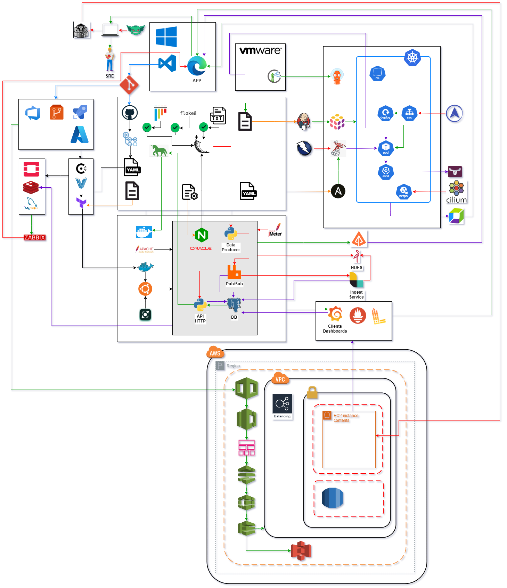
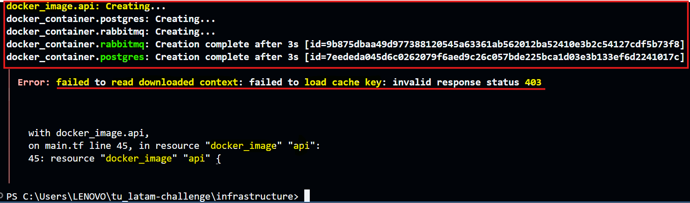
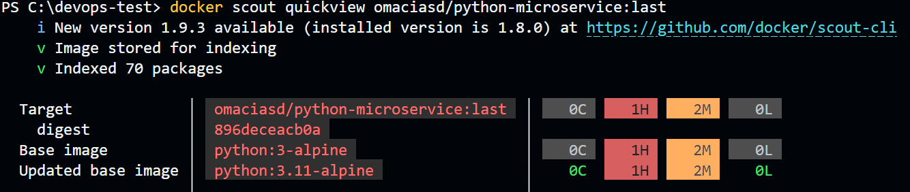
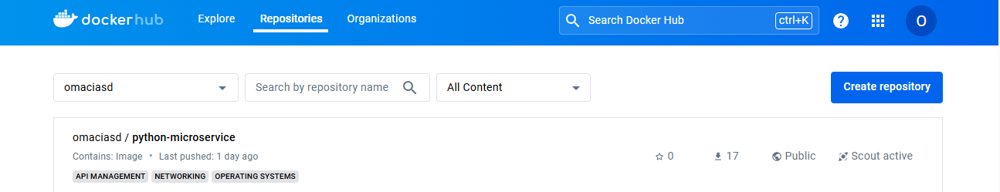
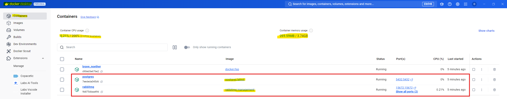
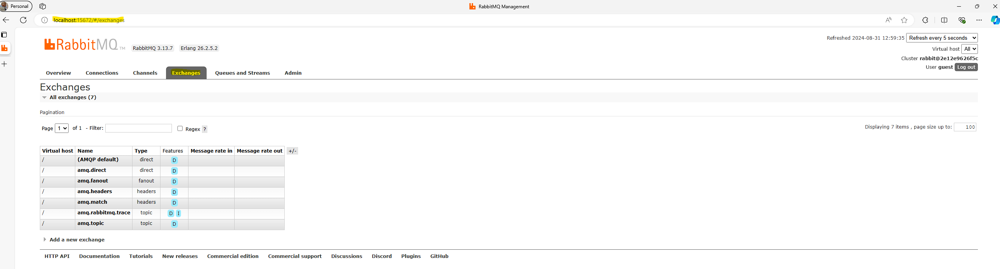
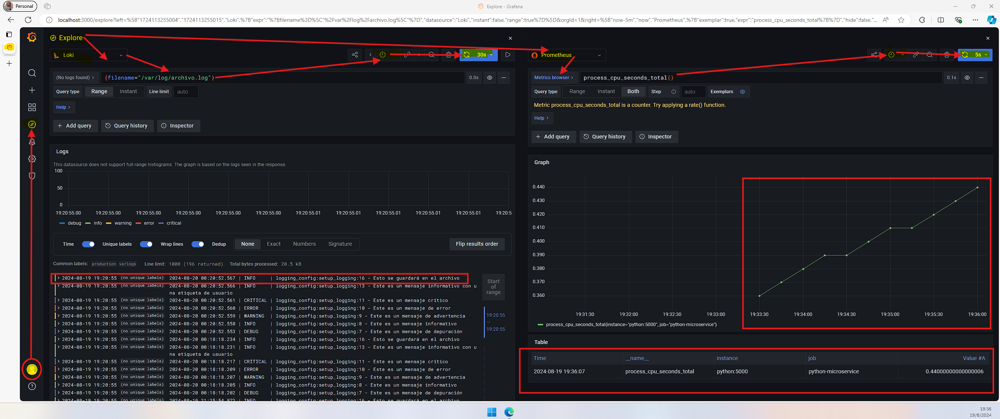
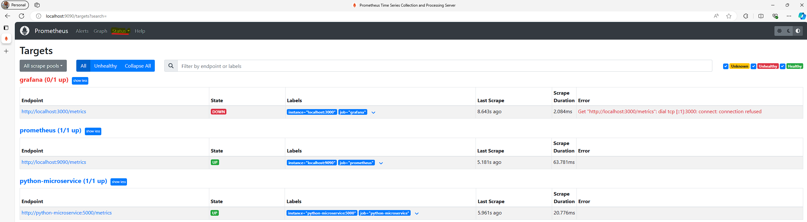

# **Architecture Guide**

## Contents

- ⚙️[System Overview](#system-overview)
- 📊[Diagram](#diagram)
- 🔗[Component Interactions](#component-interactions)
- ⚠️[Critical Points and Scaling](#critical-points-and-scaling)
- 📈[Data Flow](#data-flow)
- 🔄[Overall Flow](#overall-flow)
- 🚀[CI/CD Pipeline with GitHub Actions](#ci-cd-pipeline-with-github-actions)
- 🎯[Overall Goals and Benefits](#overall-goals-and-benefits)
- 📊[Critical Metrics for End-to-End System Health and Performanc](#critical-metrics-for-end-to-end-system-health-and-performance)
- 📈[Monitoring and Logging](#monitoring-and-logging)
- 🚧[Error Handling and Rollback](#error-handling-and-rollback)
- ➡️[Security](#security)
- ✏️[Additional Considerations](#additional-considerations)

## ⚙️**System Overview**

- **Target Audience**: This architecture is aimed at **LatAm Airlines data analysts**, developers, and business intelligence teams who require robust data processing and analysis capabilities.

- **Use Case**: Ideal for real-time data analytics, large-scale data ingestion, and high-throughput data pipelines, where the system needs to handle large volumes of data from various sources, process it efficiently, and provide actionable insights through accessible APIs.

- **Site Reliability Engineering (SRE) Integration**

  - Integrating principles ensures reliable, available, and high-performance systems, enhancing operational efficiency and the end-user experience.

## 📊**Diagram**

- **Scalability to 50 Systems**

  - **Overview**: Scalability is a cornerstone of this system's architecture, ensuring that as demand grows, the system can expand seamlessly to support or moe.

    - This section details the strategic approaches taken to ensure that the system remains robust, responsive, and reliable as it scales.

      - Modular components:
        - Ease of Replication.
        - Decoupled Architecture.
        - Upgrade and Maintenance Flexibility.

      - Load balancing strategies:
        - IP Hashing Consistency.
        - Round Robin Distribution.
        - Least Connections Optimization.

      - Distributed system architecture:
        - Microservices Architecture.
        - Data Sharding for Performance.
        - High Availability through Redundancy.
        - Global Distribution for Latency Reduction.

## 🔗**Component Interactions**

- **Cloud Access Limitations**: Unfortunately, due to the requirement for credit card verification to access cloud platforms, I was unable to leverage free tiers or trial accounts. This constraint limited my ability to test and build infrastructure directly in cloud environments.

- **Local Environment Challenges**: Initially, I attempted to use to build and manage infrastructure on Windows.

  - However, I encountered persistent compatibility issues between **Terraform** and **Docker Desktop**, which hindered the effective setup and management of the infrastructure.

- **Workaround with Vagrant**: To address these issues, I transitioned to using a based setup on a **Ubuntu** environment.

  - This local setup offered several advantages:

    - **Better Compatibility**: Allowed me to create a more controlled and compatible environment for running, addressing the compatibility problems faced with **Docker**.

    - **Local Testing and Development**: The environment provided a local solution for testing and development, enabling me to proceed with Terraform configurations and infrastructure management without relying on cloud resources.

    - **CI/CD Pipeline Preparation**: By using, I could still develop and test my infrastructure as code locally.

      - This setup ensured that once cloud access is available or feasible, the transition from local development to a cloud environment via pipelines with **GitHub Actions** would be smoother.

    - **Future Integration**: The based local setup serves as a temporary measure, allowing me to refine and validate the infrastructure code. Once cloud access is possible, I plan to migrate the tested configurations to a cloud environment for final deployment and scaling.

- **Design Choices**:

  1. **Scalability**:

      - The choice of **RabbitMQ** as the message broker, and a columnar database like **Postgres** supports high-throughput data streams and complex analytical queries, making it suitable for data-intensive applications.

  2. **Flexibility**:

      - The use of **Flask** for API development provides flexibility and ease of integration with various third-party applications and tools, enabling customized and scalable solutions.

      - This API provides standard HTTP methods for interacting with the data, making it easy for third-party applications and users to access and visualize the data using tools like **ELK**, **Grafana**, **Prometheus**, and **Loki**.

  3. **Infrastructure Management with Terraform**:

      - The entire infrastructure, including the Pub/Sub, database, and API, is provisioned and managed.

      - Ensures that the environment is consistently configured and easily replicable across different stages of the development lifecycle.

  4. **Containerization and Deployment with Docker**:

      - **Image Build**: The application is containerized, with a Dockerfile that defines the environment and dependencies.

  

      - **Environment Variables**: Keys are passed to the Docker container at runtime, based on Terraform outputs.

      - **Deployment Process**: The container is deployed to the target environment, ensuring consistency across development and production environments.

  

## ⚠️**Critical Points and Scaling**

- 🔍**Critical Points**

  - This section identifies the critical components of the system and details the strategies implemented to handle failures, ensuring high availability and resilience.

    - 🧐**Identification of Critical Components**:

      - 📚**Databases**: Databases are essential for data storage and retrieval. Ensuring their availability and consistency is crucial.

      - 🔑**Authentication and Authorization Services**: These services are vital for security and access control. Any failure here could compromise the entire system.

      - 🛣️**Gateways and APIs**: These serve as entry
      points for external applications, making them critical for service communication.

      - 📂**File Storage**: Services that store and manage critical files, such as images or documents, are essential for business operations.

    - 🛡️**Failure Handling Strategies**:

      - ♻️**Redundancy**: Implementation of backup copies of critical components (e.g., database clusters replicated across multiple availability zones).

      - ⚖️**Load Balancing**: Use of load balancers to distribute traffic across multiple servers or service instances, ensuring the system doesn’t rely on a single point of failure.

      - 🌀**Automatic Failover**: Configuration of failover mechanisms that automatically redirect traffic to redundant systems in case of a failure.

      - 🕵️**Monitoring and Alerting**: Implementation of monitoring tools that detect failures or suboptimal performance, triggering alerts and corrective actions.

- 📏**Scaling**

  - This section describes how the system is designed to scale and support a significant increase in load, such as deployment across 50 or more systems, while maintaining performance and availability.

    - 🔨**Modular Design**:
      - 🧱**Microservices**: The system is decomposed into independent microservices, allowing specific services to scale autonomously based on demand.

      - 🚢**Interoperability**: Each module or service follows communication standards (REST, gRPC), facilitating integration and scaling across different environments.

    - 🐳**Containerization**:
      - 📦**Use of Containers**: All services and applications are packaged in containers Docker, ensuring portability and consistency across deployment environments.
      - ✉️**Service Isolation**: Containers ensure that each service has its own resources, avoiding conflicts and facilitating resource management.

    - 🤖**Orchestration Tools**:
      - 🎛️**Kubernetes/OpenShift**: Orchestration platforms are used to manage the deployment, scaling, and operation of containers, enabling automated scalability.
      - 🔺**Autoscaling**: Configuration of autoscaling policies that dynamically adjust the number of service instances based on workload.

    - 💾**Load Balancing Strategies**:
      - 📡**Traffic Distribution**: Implementation of strategies to evenly distribute traffic across multiple instances, using load balancing algorithms like Round Robin, Least Connections, or IP Hashing.
      - 🌍**Geodistribution**: Use of global load balancers to distribute traffic across different geographic regions, ensuring minimal latency and high global availability.

    - ♻️**Distributed System Architecture**:
      - **Service Replication**: Distribution of service instances across multiple locations to improve resilience and reduce latency.
      - 🗂️**Distributed Caching**: Implementation of distributed caching solutions (e.g., Redis, Memcached) to enhance performance and reduce load on central databases.
      - 📬**Message Queues**: Use of distributed queue systems RabbitMQ to manage asynchronous communication between services, improving fault tolerance and scalability.

## 📈**Data Flow**

- **Ingestion to API Exposure**

  1. **Data Ingestion via Pub/Sub**:

  - **Logstash**: Data is initially ingested through the Pub/Sub layer.

    - It is published to specific topics in *RabbitMQ* where it is available for processing.

  

  - **Data Integrity**: Messages are ensured to be processed in the order they are received, and duplicate messages are handled through idempotent processing to maintain data consistency.

  1. **Data Processing and Storage**:

     - **Data Processing**: After ingestion, the data is processed as needed before storage. This may include transformations or aggregations.

  - **Database Storage**: The processed data is stored in Postgres.

  - The database uses ACID (Atomicity, Consistency, Isolation, Durability) properties to ensure data integrity and consistency.

    - This includes:

      - **Transactions**: Database transactions are used to group multiple operations into a single unit of work.

    - If any part of the transaction fails, the entire transaction is rolled back, ensuring that the database remains in a consistent state.

      - **Consistency Checks**: Regular consistency checks and validations are performed to detect and correct any anomalies in the data.

  3. **Data Exposure through API**:

     - **API Access**: The stored data is exposed via a RESTful API developed with Flask.

       - The API provides standard HTTP methods for data retrieval.

     - **Data Integrity**: Data is served directly from the database without intermediate modifications, ensuring that the data presented through the API reflects the most recent and accurate state of the database.

  4. Additional Mechanisms for Data Integrity:

     - **Error Handling**: Errors during data processing or API requests are logged and monitored.

       - Automated alerts are triggered for any data inconsistencies or processing issues.

  - **Redundancy**: Data redundancy and backup mechanisms are in place to prevent data loss.

  - Regular backups are taken, and failover strategies are implemented to ensure data availability.

- **Integration Testing**

  - **Component Integration**: Explain how integration testing is conducted between different system components, from data ingestion to data exposure.

  - **Data Flow Validation**: Describe methods to validate that data flows correctly and reliably between components.

## 🔄**Overall Flow**

1. **Data Ingestion**:
   - **Logstash** ingests data from various sources flight data, passenger information, vauls position and sends it to **RabbitMQ**.
   - **RabbitMQ** acts as the message broker, managing data streams and ensuring reliable delivery to processing services.

2. **Data Processing**:
   - Data received from **RabbitMQ** is processed by worker services. This may include filtering, aggregation, and transformation.
   - Processed data is then stored in **Postgres**, ensuring data integrity and availability.

3. **Data Storage**:
   - **Postgres** serves as the data warehouse, storing processed data with high reliability.
   - Data is stored in a structured format to support efficient querying and analysis.

4. **API Exposure**:
   - **Flask** API provides access to the stored data, allowing clients to retrieve and interact with the data through standard HTTP methods.
   - API endpoints are designed to handle high-throughput requests and ensure data accuracy.

5. **Monitoring and Alerts**:
   - **Grafana**, **Prometheus**, and **Loki** are used to monitor the health and performance of the system.
   - Alerts are configured to notify stakeholders of any critical issues or anomalies.

## 🚀**CI-CD Pipeline with GitHub Actions**

1. **Code Checkout**:
   - **Action**: The pipeline checks out the latest code from the GitHub repository.
   - **Purpose**: Ensures that the build and deployment processes use the most recent code changes.

2. **Build and Test**:
   - **Action**: Executes automated tests (unit, integration) to validate code changes.
   - **Purpose**: Maintains code quality and prevents the introduction of bugs.

3. **Build Docker Images**:
   - **Action**: Docker images are built from the Dockerfile.
   - **Purpose**: Creates consistent, portable environments for the application.

4. **Publish Docker Images**:
   - **Action**: Docker images are pushed to Docker Hub or another container registry.
   - **Purpose**: Makes the images available for deployment to various environments.

5. **Terraform Deployment**:
   - **Action**: Applies Terraform configurations to provision or update infrastructure.
   - **Purpose**: Automates the setup and management of infrastructure resources.

6. **Deploy Application**:
   - **Action**: Deploys Docker containers to the target environment.
   - **Purpose**: Ensures the application is running in the specified environment with the latest code.

7. **Post-Deployment Testing**:
   - **Action**: Performs smoke tests or validation checks after deployment.
   - **Purpose**: Confirms successful deployment and functional application.

8. **Notification and Reporting**:
   - **Action**: Sends notifications about pipeline status and deployment results.
   - **Purpose**: Keeps the team informed and responsive to deployment issues.

9. **Rollback Mechanism**:
   - **Action**: Reverts to previous versions if deployment fails.
   - **Purpose**: Provides a mechanism to restore the previous stable state of the application.

## **Integration Testing and Rollback**

- **Integration Testing**:
  - **Action**: Conduct tests to ensure all system components work together seamlessly.
  - **Purpose**: Verifies end-to-end functionality and integration of data ingestion, processing, storage, and API exposure.

- **Automated Rollback**:
  - **Action**: Implement automatic rollback procedures within the CI/CD pipeline.
  - **Purpose**: Quickly revert to stable versions in case of deployment failures.

## **Critical Metrics for End-to-End System Health and Performance**

- In addition to basic metrics like CPU, RAM, and DISK USAGE, it is crucial to monitor the following metrics to understand the end-to-end health and performance of the system:

    1. **Latency**

         - **Description**: Measures the time taken for a data packet to travel from its source to its destination. In distributed systems, latency indicates communication efficiency between services.

          - **Importance**: High latency can signal network issues, bottlenecks in the architecture, or overload in system components.

          - **Monitoring**: Measure latency across different system layers (e.g., frontend, backend, and between microservices) to identify and address issues.

    2. **Error Rate**

       - **Description**: Represents the percentage of requests resulting in errors (e.g., HTTP 4xx and 5xx codes) out of the total requests processed.
       - **Importance**: A rise in error rate may indicate problems such as configuration errors, failures in external dependencies, or network issues.
       - **Monitoring**: Track error rates at both individual service levels and across the system to detect localized and global failures.

    3. **Throughput**

         - **Description**: Measures the amount of data the system can process within a given time period, typically in terms of transactions per second or requests per minute.
         - **Importance**: Low throughput can indicate performance issues like resource saturation and affects the system's ability to handle high traffic volumes.
         - **Monitoring**: Monitor throughput at various points in the system to identify bottlenecks and ensure the system can handle expected traffic loads.

- **Scaling**

  - To ensure the system can scale to 50 or more systems, consider the following strategies:

    - **Modular Design**

      - **Description**: Break the system into modular components that can be scaled independently. Components should be loosely coupled to allow for independent development, deployment, and scaling.

      - **Use**: Implement microservices to handle different functions, such as authentication, payment processing, and user management.

- **Containerization and Orchestration**

  - **Description**: Use containers (e.g., Docker) to package services and applications, facilitating deployment and scaling.

  - **Orchestration**: Utilize orchestration tools like Kubernetes to manage and automatically scale containers based on demand.

  - **Benefits**: Allows for rapid service replication and greater flexibility in adjusting resources.

- **Load Balancing Strategies**

  - To effectively distribute traffic and improve system reliability:

    - **Round Rob**in
    - **Description**: Distributes requests sequentially acrossavailable servers.

    - **Use**: Suitable for systems with uniform load distribution.

- **Least Connections**

  - **Description**: Routes new requests to the server with the fewest active connections.

  - **Use**: Ideal for systems with varying request processing times.

- **IP Hash**

  - **Description**: Routes requests based on a hash of the client’s IP address.

  - **Use**: Maintains session affinity without additional session state storage.

- **Distributed System Architecture**

  - For scalability and resilience:

    - **Microservices Architecture**

      - **Description**: Break down the application into independent microservices that communicate via APIs. Each microservice can be developed, deployed, and scaled independently.

      - **Benefits**: Enhances scalability and allows for quick recovery from failures, as a failure in one microservice does not impact others.

    - **Event-Driven Architecture**

      - **Description**: Use events to trigger communication and processing between services. Systems respond to events asynchronously.

      - **Benefits**: Facilitates scalability as events can be processed by multiple consumers without direct communication.

    - **Data Replication**

      - **Description**: Replicate data across multiple locations to ensure high availability and fault tolerance.

      - **Benefits**: Reduces latency and ensures continuous availability even in the event of a node or data center failure.

## 🎯**Overall Goals and Benefits**

1. **Efficiency**:
   - **Benefit**: Automated CI/CD pipeline reduces manual intervention and accelerates delivery.
   - **Goal**: Streamline the development and deployment process.

2. **Consistency**:
   - **Benefit**: Ensures uniformity across environments through containerization and automated deployments.
   - **Goal**: Maintain consistent application behavior and configurations.

3. **Quality Assurance**:
   - **Benefit**: Integrated testing maintains high code quality and reliability.
   - **Goal**: Deliver robust and reliable applications.

4. **Scalability**:
   - **Benefit**: Modular design and containerization support scaling to handle increased data volumes.
   - **Goal**: Adapt to growing data and user demands.

5. **Monitoring and Reporting**:
   - **Benefit**: Provides visibility into system performance and health.
   - **Goal**: Proactively manage system issues and ensure optimal operation.

6. **SRE and Scalability**

- **SRE**:
  - **Principles**: Apply SRE practices to manage system reliability, availability, and performance.
  - **Goal**: Ensure the system meets reliability and performance expectations.

- **Scalability**:
  - **Strategies**: Design for horizontal scaling, load balancing, and efficient resource management.
  - **Goal**: Handle increased load and data volume effectively.

## 📈**Monitoring and Logging**

- **Tools and Techniques**

  - **Centralized Logging**: Use **ELK Stack** for managing logs and visualizing log data.

- **Monitoring Tools**:

  - **Grafana**: For real-time metrics and dashboards.

  

  - **Prometheus**: For collecting and querying time-series data.

  

  - **Loki**: For aggregating and visualizing logs with Grafana.

- **Alerting**: Configure alerts based on monitoring data to notify stakeholders of critical issues.

- **SLIs and SLOs**

  - **Monitoring**: Track Service Level Indicators and manage Service Level Objectives to ensure performance goals are met.

## 🚧**Error Handling and Rollback**

- **Strategies**

  - **Error Detection**: Monitor and log errors to detect issues promptly.

  - **Rollback**:

    - **Automated Rollback**: Implement automatic rollback to previous versions if deployment fails.

    - **Manual Rollback**: Provide manual procedures for reverting changes if necessary.

    - **Version Control**: Use version control to manage and revert to stable versions as needed.

- **Integration Testing**

  - **Testing and Validation**: Perform integration testing to ensure system components work together as expected.

## ➡️**Security**

- **Measures**

1. **Data Encryption**:
   - **Encryption at Rest**: Ensure that all stored data is encrypted to prevent unauthorized access.
   - **Encryption in Transit**: Use TLS to secure data transmission between services and clients.

2. **Access Control**:
   - **Authentication**: Implement strong authentication mechanisms for users accessing the system.
   - **Authorization**: Define and enforce access control policies to restrict user privileges.

3. **Vulnerability Management**:
   - **Regular Updates**: Keep all system components updated with the latest security patches.
   - **Security Scanning**: Perform regular scans for vulnerabilities in the code and dependencies.

4. **Incident Response**:
   - **Monitoring**: Set up monitoring and alerting to detect and respond to security incidents.
   - **Response Plan**: Develop and maintain an incident response plan for handling security breaches.

- **Scalability and Resilience**

  - **Security Practices**: Implement scalable and resilient security measures.

  - **SRE**: Integrate security practices within the SRE framework to ensure reliability and resilience.

## ✏️**Additional Considerations**

- **Cost Management**

1. **Cost Optimization**:
   - **Resource Utilization**: Monitor and optimize resource usage to avoid over-provisioning and reduce costs.
   - **Scaling**: Implement auto-scaling to adjust resources based on demand and avoid unnecessary expenses.

2. **Cost Reporting**:
   - **Analysis**: Regularly review cost reports and analyze spending patterns.
   - **Budgeting**: Set budgets and track expenditures to ensure alignment with financial goals.

3. **Cost Recovery**:
   - **Backups**: Implement robust backup solutions to protect against data loss and ensure recovery.
   - **Disaster Recovery**: Develop and test disaster recovery plans to minimize downtime and data loss.

4. **SRE and Scalability Management**

- **SRE**: Focus on reliability and performance management through SRE principles.

- **Scalability and Costs**: Manage the impact of scalability on costs effectively.
