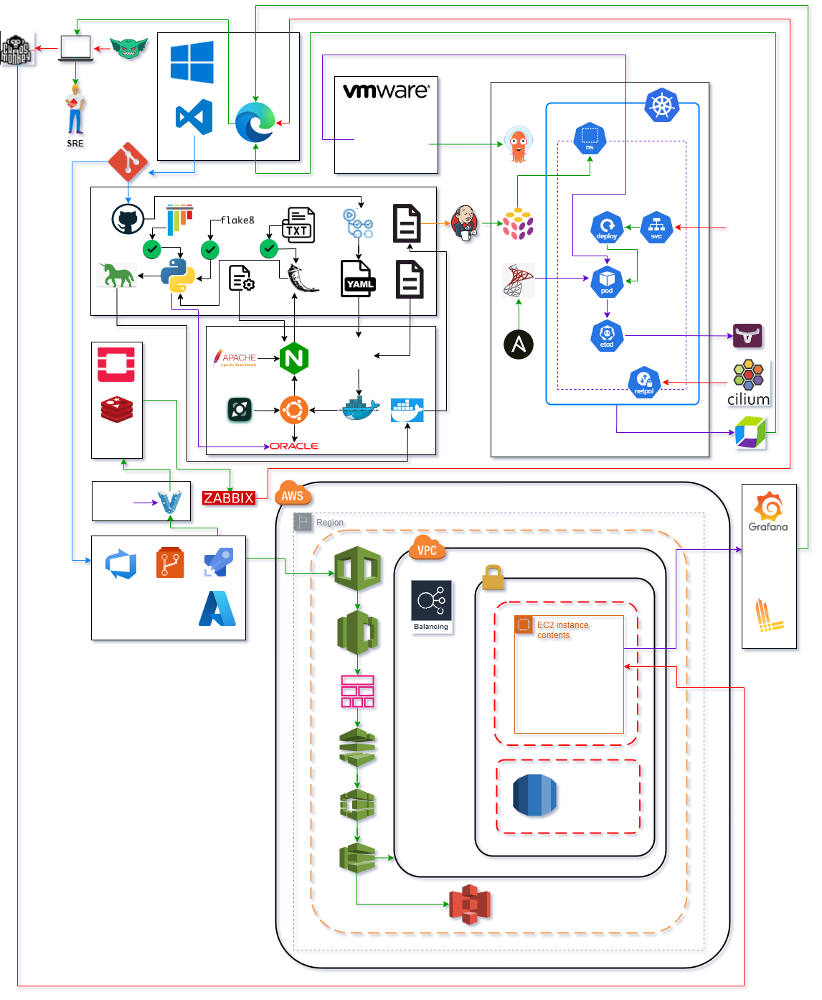

# **Architecture Guide**

## **System Overview**

Provide a high-level overview of the system, explaining the main components (Pub / Sub, database, API) and how they interact with each other.

## **Architecture Diagram**

## **Detailed Components**

### **Pub/Sub**

- **Apache Kafka / RabbitMQ** was implemented. It allows messages to be published to a "topic," from where multiple subscribers can consume and process them. This setup is ideal for managing high-throughput data streams and ensures fault tolerance and scalability.

### **Database**

- **Amazon Redshift** or **Google BigQuery**, was chosen for storing the ingested data. This type of database is optimized for running complex analytical queries on large datasets, which is crucial for advanced analytics. Columnar storage reduces I/O operations, making data retrieval faster and more efficient for analytics workloads.

### **API/HTTP Endpoint**

- Developed using **Flask / FastAPI / Django**. This RESTful API allows data to be accessed via standard HTTP methods, providing an easy way for third parties to consume the data. These frameworks were selected for their flexibility, ease of use, and robust community support.

## **Data Flow**

- Ingestion to API exposure, passing through database storage.

## **Security Considerations**

- **Security Considerations**: Mention how security is managed in each part of the system, such as API authentication, data encryption, etc.

## **Scalability and High Availability**

- **Scalability and High Availability**: Describe the decisions made to ensure the system can scale and remain available under high load.
