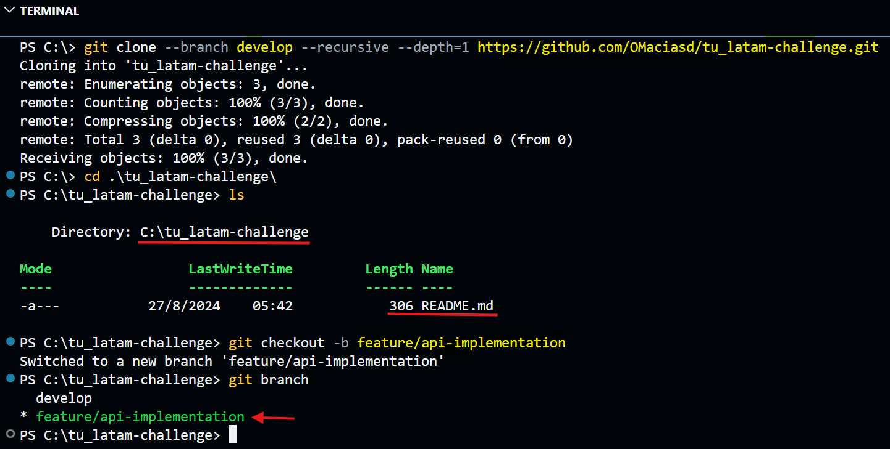

# **Contribution Guide**

## **Prerequisites**

- **Docker Desktop**: For containerized deployments.
- **GitHub Account**: For installing Python dependencies.

## **Setting Up the Development Environment**

### 🔄**Clone the repo to your local infra**

``` bash
git clone --branch develop --recursive --depth=1 https://github.com/OMaciasd/tu_latam-challenge.git; cd .\tu_latam-challenge\
```

### 🚀**Run the App**

#### ⚙️**Install Dependencies**

``` python
pip install -r requirements.txt
```

### **Setting Environment Variables**

- If necessary, explain how to configure environment variables to make the project work correctly.

## **Workflow**

### **Creating Branches**

- The solution is organized using the **GitFlow** workflow, which facilitates structured development and integration.



### **Commit Messages**

- Follow these conventions for commit messages:

  - Use the imperative mood: "Fix bug" instead of "Fixed bug".

  - Include the issue number if applicable.

### **Pull Requests**

- Submit a Pull Request with a description of the changes and link to any related issues.

## **Code Standards**

- Follow the PEP 8 style guide for Python code.

## 🔍**Testing**

### ✅**Test Coverage**

``` python
pytest --cov=src --cov-report=html
```

- **`--cov=src specifies`** the folder where the source code is located.

- **`--cov-report=html`** generates an HTML report, which is saved in the htmlcov folder.

### ✅**Load Testing**

- **Tools Used**

  - **Locust**: An easy-to-use tool for distributed load testing.

  - **Apache JMeter**: A performance testing tool that can simulate multiple users.

``` python
locust -f locustfile.py
```

- **Access Locust Web Interface**: Once Locust is running, open your browser and go to [web server](http://localhost:8089) to start the load test and monitor performance in real-time.

- **Load Test Results**

  - Response Time: [Details on response times under load]

  - Resource Usage: [Details on CPU and memory usage]

  - Errors: [Details on any errors encountered during testing]

## **Code Review**

- Pull requests are reviewed by project maintainers. Ensure your code meets the project's standards and passes all tests.

## **Documentation Contributions**

- For contributing to documentation, follow the same branch and PR process as code contributions.
