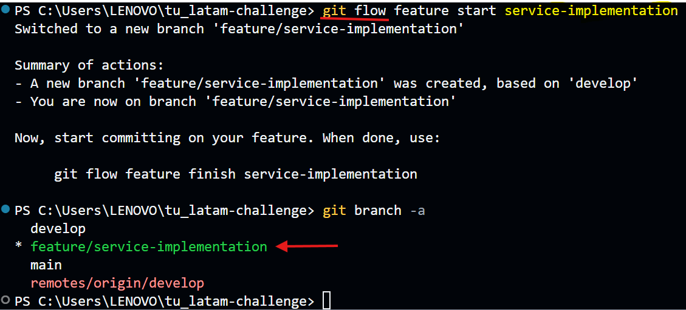

# **Contribution Guide**

## **Contents**

- 🧩[**Project Structure**](#project-structure)
- 🚨[**Managing Sensitive Files**](#managing-sensitive-files)
- 📥[**Setting Up the Development Environment**](#setting-up-the-development-environment)
- 📝[**Workflow**](#workflow)
- 🔍[**Testing and Verification**](#testing-and-verification)
- 🌐[**Commit Messages**](#commit-messages)
- 🌐[**Submitting Pull Requests**](#submitting-pull-requests)
- 🚀[**Code Review**](#code-review)
- 📂[**Verifying the Pipeline in the Repository**](#verifying-the-pipeline-in-the-repository)
- 🖥️[**Documentation Contributions**](#documentation-contributions)

## 🧩 **Project Structure**

**app/**: Contains the main application code.
**config/**: Configuration files for different environments.
**docker/**: Docker-related files.
**tests/**: Test cases for the application.

## 🔒 Managing Sensitive Files

### `.env` Files

- **Description**: The **`.env`** file contains essential environment variables for project configuration, such as credentials and API keys.

- **Setup**: Create a **`.env`** file in the root of the project using the **`.env-example.txt`** file as a reference. Fill it with your own variables.

- **Important**: The **`.env`** file is listed in **`.gitignore`** to prevent it from being uploaded to the repository.

### JSON Files

- **Description**: The **`data.json`** file may contain environment-specific or sensitive data.

- **Example File**: Use the **`json-example.txt`** file as a reference to understand the structure of the JSON file. Do not include sensitive data in the repository.

## **Setting Up the Development Environment**

### **Setting Environment Variables**

- If necessary, explain how to configure environment variables to make the project work correctly.

## **Workflow**

### **Creating Branches**

- The solution is organized using the **GitFlow** workflow, which facilitates structured development and integration.



## 🔍 **Testing and Verification**

### **Code Standards**

- Follow the PEP 8 style guide for Python code.

### ✅ **Test Coverage**

``` python
pytest --integration --cov=src --cov-report=html
```

- **`--cov=src specifies`** the folder where the source code is located.

- **`--cov-report=html`** generates an HTML report, which is saved in the htmlcov folder.

### ✅ **Load Testing**

- **Tools Used**

  - **Locust**: An easy-to-use tool for distributed load testing.

  - **Apache JMeter**: A performance testing tool that can simulate multiple users.

``` python
locust -f locustfile.py
```

- **Access Locust Web Interface**: Once Locust is running, open your browser and go to [web server](http://localhost:8089) to start the load test and monitor performance in real-time.

- **Load Test Results**

  - Response Time: [Details on response times under load]

  - Resource Usage: [Details on CPU and memory usage]

  - Errors: [Details on any errors encountered during testing]

## **Commit Messages**

- Follow these conventions for commit messages:

  - Use the imperative mood: "Fix bug" instead of "Fixed bug".

  - Include the issue number if applicable.

## **Submitting Pull Requests**

- Submit a Pull Request with a description of the changes and link to any related issues.

## Code Review

- Pull requests are reviewed by project maintainers. Ensure your code meets the project's standards and passes all tests.

## 📂 Verifying the Pipeline in the Repository

To verify the CI/CD pipeline configured in this repository:

1. **View Workflows:**
   - Navigate to the **Actions** tab in GitHub to see the configured workflows. Here, you can view the executed CI/CD pipelines and their status (success or failure).

2. **Review Executions:**
   - Within the **Actions** tab, select a specific workflow run to view details. You can review the logs of each step, from code linting to deployment.

3. **Manual Execution:**
   - If you have the appropriate permissions, you can manually trigger a workflow from the Actions tab, allowing you to test the pipeline on any specific branch or commit.

4. **Configuration Files:**
   - Check the `.github/workflows/main.yml` file in the root of the repository to understand the pipeline configuration. This file defines the steps and actions executed during the CI/CD process.

## **Documentation Contributions**

- For contributing to documentation, follow the same branch and PR process as code contributions.
